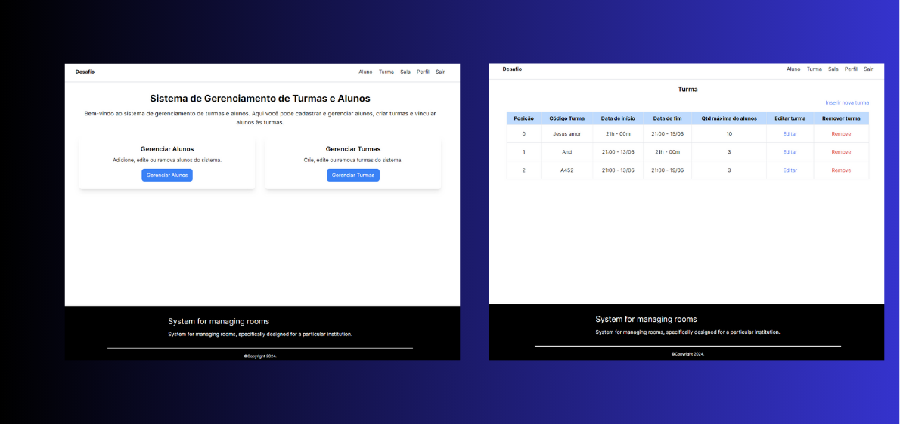
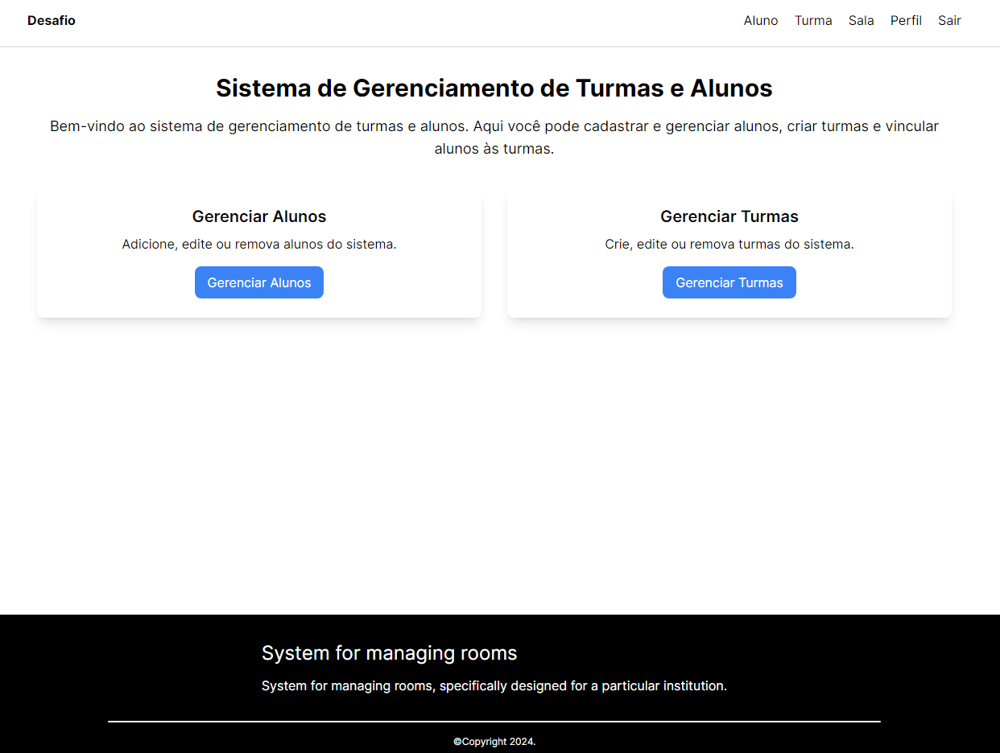

# Sistema de cadastramento de classe

## Requisitos do Sistema

Para operar o sistema, são necessários os seguintes requisitos mínimos na sua máquina: PHP, Composer, Node.js. O PHP e o Composer são essenciais para executar o Laravel, que contém a API principal do sistema. O Node.js é necessário para executar o front-end, enquanto o Composer é utilizado para executar a API é executada. Estes componentes garantem a funcionalidade e o desempenho ideais do nosso sistema de forma integrada e eficiente.

## Requisitos Funcionais

### RF01. Cadastro sala, aluno e turma

- O sistema é capaz de gerenciar salas de aula, alocando o aluno nas turmas e mostrando em qual turma o aluno está. É possível fazer a alteração do aluno e a exclusão da alocação do aluno a determinada sala.

Regras:

- Todos os que tiverem acesso ao sistema deverão ter acesso a todas as informações do sistema.

### RF02. Cadastro de aluno

Regras:

- Alunos: Nome, campo: Obrigatório, CPF (o campo CPF não pode se repetir), campo: Obrigatório, sexo (Masculino ou Feminino), campo: Obrigatório, data de nascimento (maior que 01/01/1900), campo: Obrigatório, e-mail (o campo e-mail não pode se repetir), campo: Obrigatório, renda mensal (Valor monetário maior que zero), campo: Opcional (Não obrigatório).

### RF03. Cadastro da turma

Regras:

- Turmas: Código da turma. Caracteres livre informado pelo usuário, campo: Obrigatório, Data de Início (maior ou igual a Data Atual), campo: Obrigatório, Data de Fim (Maior que a data de início da turma), campo: Obrigatório, Quantidade máxima de alunos na Turma. Número inteiro maior que zero, campo: Obrigatório. Esse campo limita o máximo de alunos que a Turma pode ter.

## Arquitetura do Sistema

O sistema utiliza as seguintes tecnologias:

- **Linguagens:** PHP, TypeScript
- **Banco de Dados:** MySQL
- **Frameworks:** Laravel, Next.js
- **Arquitetura da API:** MVC, RESTful
- **Outras Tecnologias:** React, Docker

## Como Iniciar o Sistema

### Passo 1: Download dos Arquivos

Clone o repositório:

```bash
git clone https://github.com/andre-albuquerque01/class-management-system.git
```

### Passo 2: Configuração do Back-end

Entre na pasta back-end:

```bash
cd /Api
```

Inicialize os pacotes do Laravel:

```php
composer install
```

Crie um arquivo `.env` na raiz do seu projeto e configure as variáveis de ambiente conforme necessário.
Execute `php artisan config:cache` para aplicar as configurações do arquivo `.env`.

Inicie o servidor da API:

```bash
php artisan serve
```

### Passo 3: Configuração do Front-end

Entre na pasta front-end:

```bash
cd ../interface
```

Baixe as dependências do Node.js:

```bash
npm i
```

Inicie o servidor do Next.js:

```bash
npm run dev
```

### Passo 4: Acesso ao Sistema

Abra o navegador e acesse `http://localhost:3000` para utilizar o serviço.

### Imagens do sistema

#### A seguir, apresentamos algumas imagens que demonstram as funcionalidades do sistema

- Início



- Dashboard


